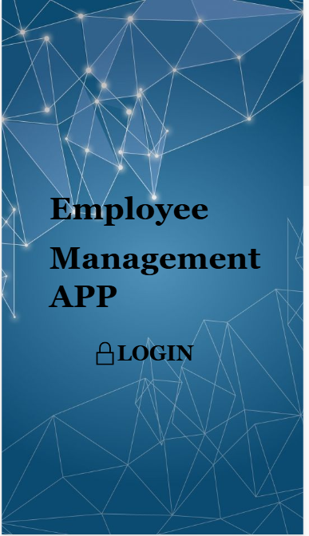
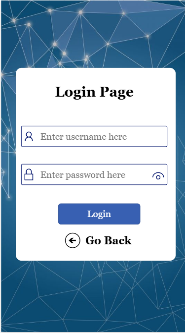
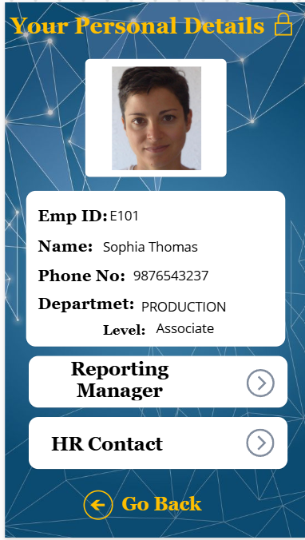
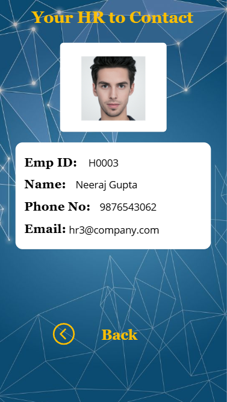

# Employee Management System – Power Apps + Excel

A role-based employee portal built using Microsoft Power Apps and Excel (OneDrive) as a structured backend.

## 🔑 Key Features
- Role-based login for Employees, HR, and Managers
- Dynamic, filtered views based on user role
- Cross-sheet referencing to simulate relational table structure
- Screens for Personal Info, HR Contact, Department, and Salary Ranges
- Designed with Azure SQL structure, later adapted to Excel for free-tier access

## 🧰 Tools Used
- Microsoft Power Apps (Canvas App)
- Excel (OneDrive)
- Power Automate (free-tier tested)

## 📸 Screenshots
| Home Screen | Login Screen | Role View | HR Contact |
|--------------|--------------|-----------|------------|
|  |  |  |  |

## 📹 Demo Video
Watch it here: [Click to view]([https://your-link-here](https://www.linkedin.com/posts/hima-sameera-munjampally-16893b171_powerapps-excel-employeemanagement-activity-7317357683517362178-4fRJ?utm_source=share&utm_medium=member_desktop&rcm=ACoAACjlOiABZ27BIxBHXPJPVNtzrfYH53KKa2k))

## 📁 Files
- `EmployeeManagementApp.xlsx` – Static Excel backend with multiple sheets for Employees, HR, Departments, and Salaries

## 💡 Value
This project simulates a real-world HR solution using low-code/no-code platforms, including secure login logic, user-role filtering, and business-facing UI design. It was originally intended for Azure SQL integration and later adapted to Excel due to licensing constraints, preserving the same architecture.

